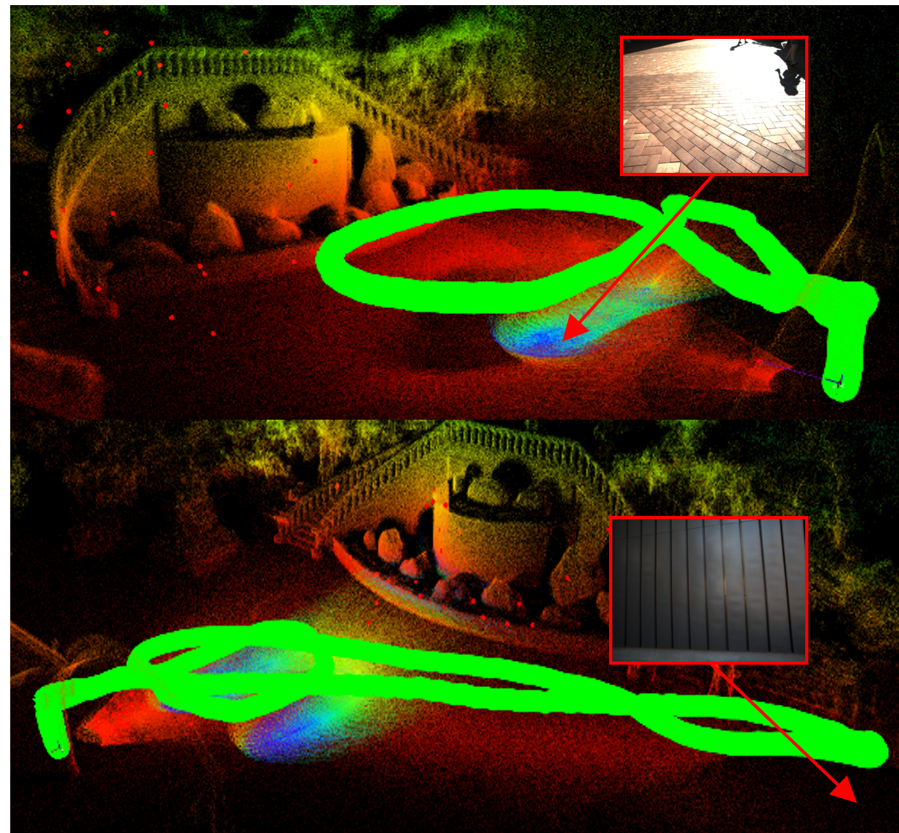
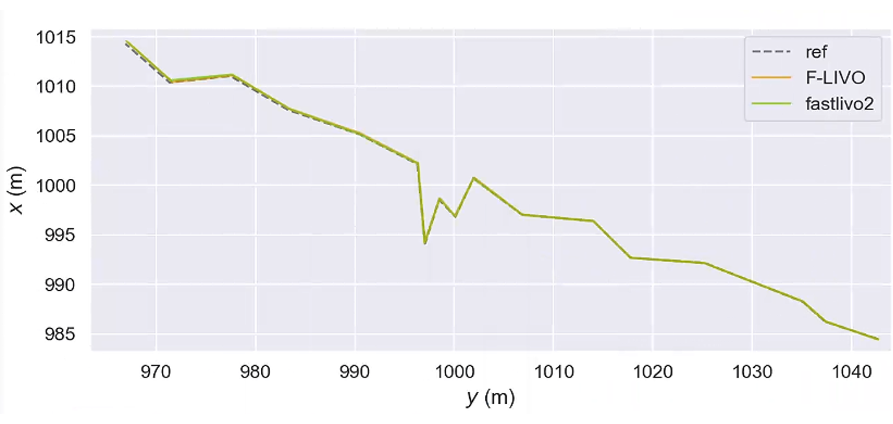

<div align="center">

# F-LIVO
## Feature-Level Fusion for Enhanced LiDAR-Inertial-Visual Odometry

<p align="center">
  <a href="#"></a>
  <a href="#"></a>
  <a href="#"></a>
  <a href="#"></a>
  <a href="#"></a>
</p>

**Xinye Dai, Yapeng Wang, Shujie Zhou, Zihao Wang, Shiqi Zheng, Jiayu Hu, Yusheng Wang, Weiwei Song, Weiming Tang**

<br>



<br>

<!-- CODE COMING SOON ALERT -->
<br>
<table align="center" width="100%">
  <tr>
    <td align="center">
      <br>
      <h1>🚧 &nbsp; Code Availability &nbsp; 🚧</h1>
      <br>
      <h1>The complete source code and datasets for F-LIVO will be publicly released upon the acceptance of the paper.</h1>
    </td>
  </tr>
</table>
<br>

</div>

## 📝 1. Introduction

This is the official code repository of **“F-LIVO: Feature-Level Fusion for Enhanced LiDAR-Inertial-Visual Odometry.”**

**F-LIVO** is a compact and efficient LiDAR–Inertial–Visual Odometry (LIVO) framework that performs **feature-level fusion** between LiDAR, IMU, and camera measurements. Instead of densely coupling raw sensor observations (densely colorizing points), F-LIVO establishes **direct point-to-plane constraints** between visual point features and LiDAR plane features. This enables robust cross-modal coupling with significantly lower computational overhead.

By focusing on structured geometric primitives, F-LIVO improves robustness in challenging scenarios such as visually degraded environments or LiDAR-degenerate scenes dominated by large planar surfaces, while preserving the modularity and independence of individual subsystems.

### ✨ Key Features

| Feature | Description |
| :--- | :--- |
| **Feature-Level Fusion** | Implements direct point-to-plane constraints between visual 2D points and LiDAR 3D planes. |
| **Lightweight Design** | Unified filter-based estimation without high-dimensional variables; very low CPU usage. |
| **Robustness** | Handles sensor degradation (e.g., texture-less walls, lidar-degenerate tunnels) by complementary sensing. |
| **Efficiency** | Fast non-iterative plane extraction (**<1 ms**); runs efficiently on varying hardware platforms. |

---

## 🏗️ 2. System Overview

F-LIVO fuses data from LiDAR, Camera, and IMU in an Error-State Kalman Filter (ESKF) framework.

<p align="center">
  
</p>

---

## 📊 3. Results & Evaluation

We evaluated F-LIVO on various public datasets (e.g., i2Nav-Robot Dataset, Hilti SLAM Dataset).

<p align="center">
  
  <br>
  <em>Figure: Trajectory accuracy comparison against state-of-the-art methods.</em>
</p>

---

## 🛠️ 4. Dependencies (Preview)

The system is tested on **Ubuntu 20.04** with **ROS Noetic**.

*   Recommended Configuration:
    *   **OS**: Ubuntu 20.04
    *   **ROS**: Noetic
    *   **Libraries**: PCL (>= 1.8), Eigen (>= 3.3), OpenCV (>= 3.2)
    *   **Drivers**: Livox_ROS_Driver (If using Livox LiDAR)

---

## 🚀 5. Build & Run

**Detailed instructions for building and running F-LIVO will be updated here once the source code is released.**  

We are currently organizing the code and documentation to ensure ease of use. Thank you for your patience!

---

## 📖 6. Citation

If you use F-LIVO in your research, please cite our work (BibTeX will be updated upon publication):

```bibtex
@article{dai2026flivo,
  title={F-LIVO: Feature-Level Fusion for Enhanced LiDAR-Inertial-Visual Odometry},
  author={Dai, Xinye and Wang, Yapeng and others},
  journal={Submitted to IEEE Transactions on Instrumentation & Measurement(TIM)},
  year={2026}
}
```

---

## 👏 7. Acknowledgements

We refer to the code structure of [FAST-LIO2](https://github.com/hku-mars/FAST_LIO) and [ov_plane](https://github.com/rpng/ov_plane). Thanks for their great works.
